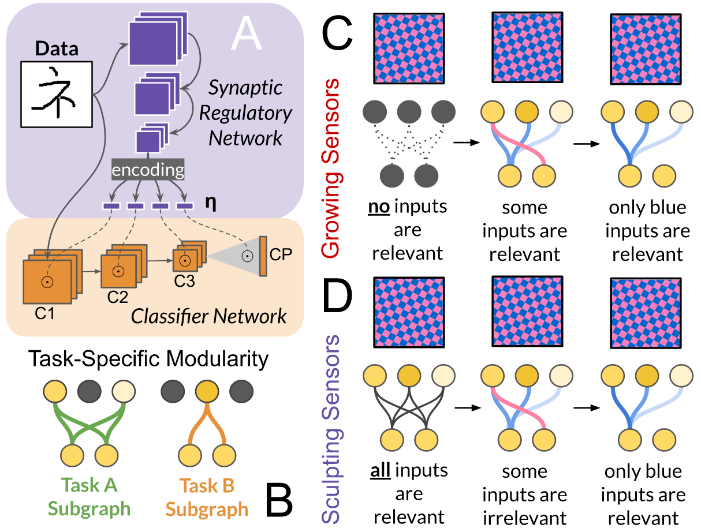

# TSAR
### Tuning Synapses via Allostatic Regulation

 

Code for the paper "Continual learning under domain transfer with sparse synaptic bursting"
by Shawn L. Beaulieu, Jeff Clune, and Nick Cheney

## Abstract:

> Existing machines are functionally specific tools that were made for easy prediction and control. Tomorrow’s machines may be closer to biological systems in their  mutability, resilience, and autonomy. But first they must be capable of learning, and retaining, new information without repeated exposure to it. Past efforts to engineer such systems have sought to build or regulate artificial neural networks using task-specific modules with constrained circumstances of application. This has not yet enabled continual learning over long sequences of previously unseen data without corrupting existing knowledge—a problem known as catastrophic forgetting. In this paper, we introduce a system that can learn sequentially over previously unseen datasets (ImageNet, CIFAR-100) with little forgetting over time. This is accomplished by regulating the activity of weights in a convolutional neural network on the basis of inputs using top-down modulation generated by a second feed-forward neural network. We find that our method learns continually under domain transfer with sparse bursts of activity in weights that are recycled across tasks, rather than by maintaining task-specific modules. Sparse synaptic bursting is found to balance enhanced and diminished activity in a way that facilitates adaptation to new inputs without corrupting previously acquired functions. This behavior emerges during a prior meta-learning phase in which regulated synapses are selectively disinhibited, or grown, from an initial state of uniform suppression.

Requests for computation and fully meta-learned models can be addressed to shawn.beaulieu@uvm.edu. In the case of computation, blind replications and extensions of this work can be arranged.

To launch a meta-learning run of TSAR, use the following command:

> python meta-learning.py --steps 25000 --rln 10 --meta_lr 0.001 --update_lr 0.1 --name mrcl_omniglot --seed 999 --tasks 1 --update_step 20 --num_classes 963 --bias -8 --channels 112 --nm_channels 192 --size_of_representation 112 --size_of_interpreter 1728 --dataset 'omniglot' --first_order --model_name 'TSAR_Rich'

Once the model has finished meta-learning, you can evalute its ability to avoid catastrophic forgetting under domain transfer with the following command:

> python domain_transfer.py --rln 6 --model TSAR_Rich_Bias=-8.0_Seed --model_seed 999 --num_updates 30 --bias -1.7 --seed 0 --treatment 'Grow' --condition 'Rich' --dataset "imagenet" --imagenet_condition "random"

Data from (truncated) ImageNet must be [downloaded separately](https://github.com/yaoyao-liu/mini-imagenet-tools) for domain transfer.

